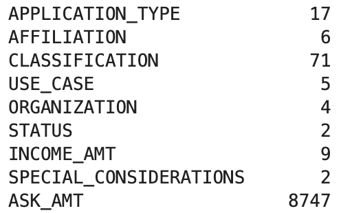

# Neural_Network_Charity_Analysis
## Overview
This is a neural network model created to help a charitable funding organization, Alphabet Soup, analyze their funding data to understand which applicants will make successful use of their funding.
## Results
### *Data Preprocessing*
* The 'IS_SUCCESSFUL' column is the target variable of this model.

* The features of this model are listed below. 

* The ID columns, 'EIN' and 'NAME' are neither targets nor features, and so were dropped from the dataframe.

### *Compiling, Training, and Evaluating the Model*
* Initially, I used 80 neurons for the first hidden layer, 30 neurons for the second hidden layer, and the Rectified Linear activation function for computational efficiency.

* The target model performance was 75%, but the closest the model came was 73% accuracy.

* I made three separate adjustments to try to optimize the model performance; I tried to drop the extraneous 'STATUS' column, I increased the bin size for the 'APPLICATION_TYPE' column, and finally I added a third hidden layer and changed the number of nodes for each layer. None of these adjustments resulted in an increased model performance.

## Summary
 With a 73% accuracy rate and 55% loss rate, this model has a lot of room for improvement. Trying an activation function that is better suited for nonlinear data and relationships on the hidden layers, such as the sigmoid function, might help improve the models classification accuracy.